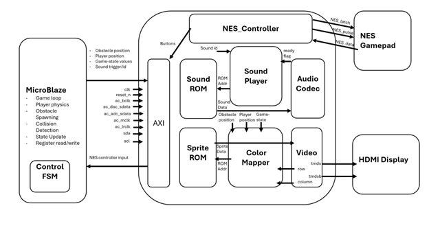
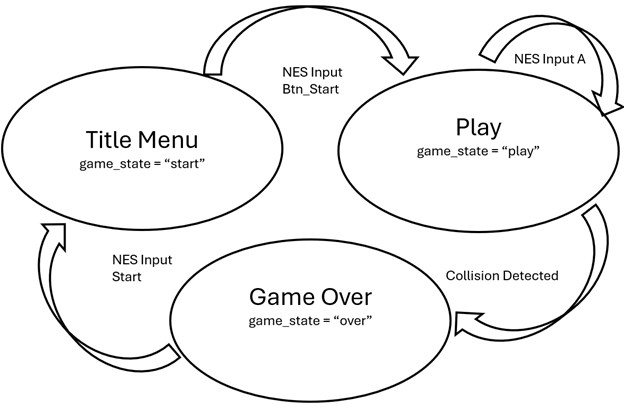

# Jetpack Joyride — Final Project

**Author:** Jake Miller
**Course:** ECE 383 — Lt Col Trimble
**Platform:** Nexys Video Board (VHDL + MicroBlaze)

---

## Overview

A hardware-based implementation of *Jetpack Joyride* in VHDL on the Nexys Video Board. The player controls Barry, a character with gravity-based movement, who must avoid laser and missile obstacles while a score accumulates. Game logic runs partially in hardware (sprite rendering, sound playback, NES input) and partially in software on MicroBlaze (game loop, physics, collision detection, state updates).

---

## System Architecture


The design splits responsibilities between MicroBlaze software and custom VHDL hardware blocks connected over AXI:

- **MicroBlaze (software):** Game loop, player physics, obstacle spawning, collision detection, score and state updates, register read/write
- **AXI Interface:** Bridges MicroBlaze with hardware peripherals
- **NES Controller:** Reads button states from a physical NES gamepad
- **Sound Subsystem:** Sound ROM, Sound Player, and Audio Codec
- **Video Subsystem:** Sprite ROM, Color Mapper, and Video/VGA output to HDMI display
- **Control FSM:** Manages overall game state transitions in microblaze



---

## Implementation Notes

### Audio Pipeline

- Source audio is converted from `.wav` files into 4-bit hex values, then loaded into a ROM file using a Python `hex-to-ROM` script.
- A custom **Sound Player** module takes a `start` signal (driven by game state in the datapath) along with the selected audio ID. It uses these inputs to reference the Sound ROM and outputs the resulting audio signal to the **Audio Codec (AC)**.
- The **sfx ID** and **trigger signal** (indicating whether a sound should play) are read from `slv_reg21`.
- A **busy signal** is written back to `slv_reg21` so MicroBlaze can poll whether a sound is currently playing before issuing another trigger.

### NES Controller

- A custom VHDL file drives the NES controller interface and reads its button signals for use in MicroBlaze.
- A clocked process drives the shift register and stores the current button state, which is then exposed to software through the AXI register interface.

### Color Mapper / Video

- The Color Mapper takes in the current coordinates of **Barry**, the **zapper**, and the **missile** as inputs.
- It draws the appropriate game state (Title Menu, Play, or Game Over) at a predetermined screen location based on the current `game_state` input.
- During Play mode, the Color Mapper also drives the score counter on screen.

---

## Register Map

| AXI Address | Register   | Field  | Meaning                                              |
|-------------|------------|--------|------------------------------------------------------|
| 0x2C        | slv_reg11  | [9:0]  | barry_x                                              |
| 0x30        | slv_reg12  | [9:0]  | barry_y                                              |
| 0x34        | slv_reg13  | [9:0]  | zapper_x                                             |
| 0x38        | slv_reg14  | [9:0]  | zapper_y                                             |
| 0x3C        | slv_reg15  | [9:0]  | missile_x                                            |
| 0x40        | slv_reg16  | [9:0]  | missile_y                                            |
| 0x44        | slv_reg17  | [7:0]  | NES buttons                                          |
| 0x48        | slv_reg18  | [2:0]  | game_state[1:0]: 00=START, 01=PLAYING, 10=GAME_OVER  |
| 0x54        | slv_reg21  | [3:0]  | [0] = 1 to start / 0 to rearm; [3:1] = sound ID      |

---

## Game State Machine

The game uses a three-state FSM managed by MicroBlaze:

- **Title Menu** (`game_state = "start"`) → transitions to **Play** on NES `Btn_Start`
- **Play** (`game_state = "play"`) → loops on NES `Input A` (jetpack thrust), transitions to **Game Over** when a collision is detected
- **Game Over** (`game_state = "over"`) → transitions back to **Title Menu** on NES `Start`

---

## Core Calculations

**Motion (obstacles):**
```
x_next = x_laser - speed
speed  = 4 pixels/update
```

**Pixel detection (sprite hit-testing):**
```
if (col >= x_obj AND col < x_obj + width)
   AND (row >= y_obj AND row < y_obj + height)
then pixel belongs to object

sprite_x    = col - x_obj
sprite_y    = row - y_obj
ROM_address = sprite_y * width + sprite_x
```

**Collision (AABB overlap):**
```
x_barry < x_obj + width_obj  AND  x_barry + width_barry > x_obj
AND
y_barry < y_obj + height_obj AND y_barry + height_barry > y_obj
```

**Gravity / thrust:**
```
if thrust_button = 1: v = v - thrust_step
else:                 v = v + gravity_step
y = (y + v)
```

---

## Milestones

**Milestone I — Static Display**
Render a static scene with all sprites in fixed positions: backdrop, Barry, lasers, and missiles. Used to confirm sprite logic and VGA/video functionality.

**Milestone II — Game State and Scrolling**
Implement game state transitions and the scrolling effect. Lasers move across the screen at the target speed, laser and missile spawning is handled correctly, and collision logic plus score updates work as expected.

---

## Required Functionality (Changes made from original approved by Lt Col Trimble)

- Controllable player character with gravity-based movement
- NES controller button activates upward jetpack thrust
- Yellow laser obstacles with collision detection and death logic
- Missile obstacles with collision detection and death logic
- Game over / end screen when the player is defeated
- Graphical rendering of all gameplay elements

### B-Level Goals
- laser and missile collision logic
- Continuously updating score counter

### A-Level Goals
- Menu options/display in the game
- Original *Jetpack Joyride* sound effects

---

## Test Results
- Overall, this project was a success. The first step in the process was getting a single sprite to draw on the screen at a desired location. This was first achieved by drawing Barry, the background, a laser, and a missile. After these static images were confirmed, their locations were replaced with registers. Register mapping and control was tested in final_project_mk1 to ensure proper update of sprite location. After this was achieved, NES controller input was implemented. Again, using microblaze and register mapping, testing of the gamepad input was confirmed. Following this functionality, game play logic was implemented, with control of Barry working successfully and the scrolling of laser and missile across the screen to simulate forward movement. Next, game states were implemented so that title and a menu screen were present. Following confirmation that these sprites were being drawn appropriately, the score counter and sound effects were implemented. It was found that audio ROM was the simplest approach and works effectively. Five sound effects were added: jetpack thruster noise, missile warning, missile launch, laser death, and missile death. All of these sound effects and the game states were successfully driven by the C code to control position, menu titles, and sound effects based on collision logic and NES controller input. 
- Some issues came about throughout the process, like the counter updating too quickly because improper implementation with the clock divider and the speed of scrolling/thrust mechanics of Barry. This required some tweaks to get the gameplay as close as possible to the mobile app. In total, 5 diffent microblaze projects were created and many bitstreams attempted. 
- In total, the vhdl implementation of jetpack joyride is fairly well emulated, with some missing functionality to include coins, scientists, etc. which can be added or attempted in the future.

---

## Appendix A
- To set up a working demo, open the project in vivado and generate a bitstream
- go to file -> export -> hardware -> include bitsteam and save
- open Vitis and make a new application project
- select the exported hardware and create the application project with hello_world.c
- remove drives from the hw folder, delete the custom IP, and remove line 8 of the makefile
- import or copy/paste hello_world.c and build then run on hardware
- this should have the final project uploaded to the board
- press start to begin the game, and use A on the NES to boost
- press start if you die to reset the game
- HAVE FUN!


---

## Documentation Statement

Used the previous ECE 383 Flappy Bird implementation as inspiration from Payton Nunn. Talked through high-level functionality with C1C Payton Nunn. Brainstormed with ChatGPT for what could live in hardware vs. software, and to help identify what I would need to mathematically determine in my implementation. Sprite assets sourced from: <https://github.com/Adarsh321123/Jetpack-Joyride>. Used Claude to help me debug my color mapper, NES controller, sound player, and C-code. In my color mapper helped me to relize that I needed n+1 signals, in my nes controller  to think through what the FSM should look like, and in my sound player to define what elements of my process are needed to synch the signal. Used to speedup some of the redundant code: like in_barry, in_zapper, to swap our variable names. Used script from Lt Col Trimble to create vhdl for sprite rom and my own for sfx rom. Used claude to help organize and clean up my code for any syntax errors and vhdl specific asthetics. Additionally used Claude to convert from google doc to README.md format for this final write up.

