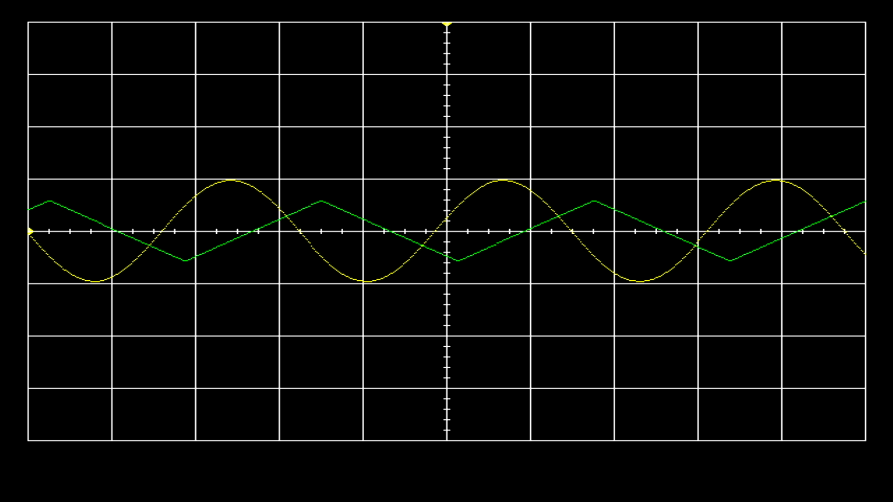
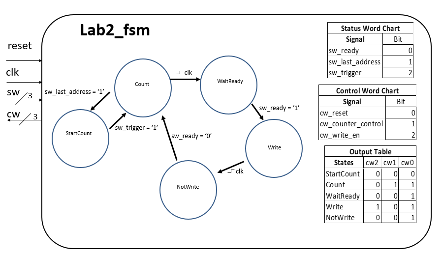
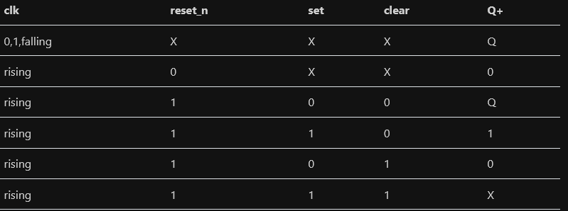
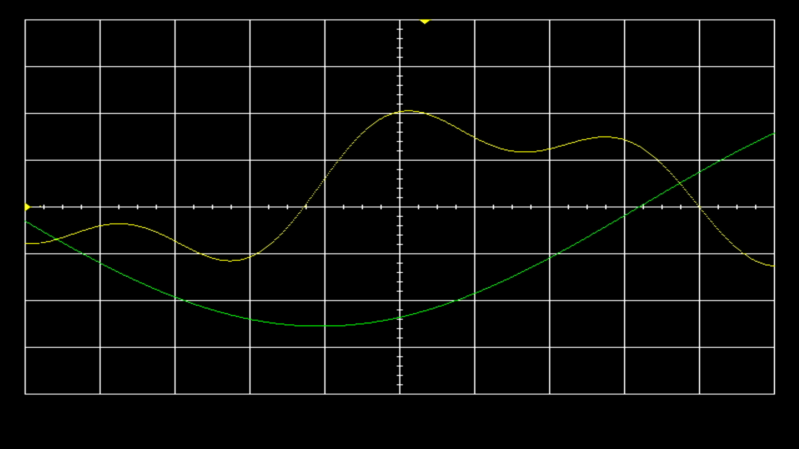

# Lab 2: Data Acquisition, Storage, and Display Report

**Name: Jake Miller**  
**Course / Section: ECE 383**  
**Instructor: Lt Col Trimble**  
**Lab Title: Data Acquisition, Storage, and Display Report**  
**Date Submitted: 1 Mar 2026**  

# 1. Introduction
In lab one we are tasked to "integrate the video display controller developed in lab 1 with the audio codec on the Nexys Video board to build a basic 2-channel oscilloscope." An image is attached showing an example of a disired output:

## 1.1 Problem Overview  
This lab uses an audio codec, block RAM (BRAM), and a finite state machine (FSM) to capture, store, and ultimately display waveform data for two channels. The system works in real time, uses memory interfacing techniques, and a modular architecture to accomplish the problem. The primary challenge is to:
1) Acquire real-time audio data sampled from the audio codec at 48KHz
2) Convert that data into unsigned 2's complement format
3) Store that in BRAM using triggering logic and write enable to stabilize the waveform
4) Read and display the waveform on vga monitor using lab 1 architecture
5) Use databath and control logic methodology

## 1.2 System Goal  
As stated the goal is to create a functioning oscilloscope using the FPGA which can display live audio input for two channels centering the waveform with user driven trigger control.

## 1.3 Functional Requirements  
In addition to the requirements described in the problem overview, the system must:
1) Implement a flag register for MicroBlaze integration
2) Have external selector logic for future MicroBlaze integration

Gate check requirements:
1) GC1: Display BRAM test signals
2) GC2: Write simulated audio sampls from codec to BRAM and display
3) GC3: Write live audio samples and have loop back for output

B-Level:
1) Display two channels
2) Implement flag register and external selector muxes

A-Level:
1) Trigger voltage and time can be adjusted
2) Features button debouncing
3) Starts with triggers aligned to column 20

## 1.4 High-Level System Description  
The system uses a modular architecture divided into a Datapath and Control Unit. The Datapath contains an audio codec to extract left and right channel data; a method of converting channel data to unsigned 2's complement, a control unit to wait for ready signal from the audio codec, a reset, write enable logic, and method to drive the counter; a triggering mechanism; a memory system (BRAM); a flag register for future MicroBlaze integration; and VGA monitor display architecture.

# 2. Design / Implementation

## 2.1 System Block Diagram 
As can be seen in the attached block diagram, the system is broken down into a datapath and a control unit. These two systems work in tandem to write audio data from the codec into the BRAM and drive a counter to track the 1024 samples output from the audiocodec consistently. Within the datapath are the primary components including the audiocodec, conversion logic, BRAM, trigger detector, counter, numeric steppers (trigger values), vga video component, and flag register.

## 2.2 Module Descriptions  

### 2.2.1 Module: Lab2

**Overall Purpose**  
The purpose of this module is to provide the high level control logic. It contains the button debouncers and links the datapath to the control unit.
**Inputs**
clk, reset_n, ac_adc_sdata, scl, sda, switch, btn
**Outputs**
ac_mclk, ac_dac_sdata, ac_bclk, ac_lrclk, scl, sda, tmds, tmdsb
**Behavior**
The module instantiates the button debouncers, the datapath, and the fsm, wiring all input and outputs between the components and the board. Importantly is carries the control word and status word between the FSM in the control unit and the datapath.

### 2.3.1 Module: lab2_datapath

**Overall Purpose**  
This component is used to wire all the components for live reading, storage, and output of the audiosignals.
**Inputs**
clk, reset_n, ac_adc_sdata, scl, sda, cw, btn, switch, exWrAddr, exWen, exSel, exLbus, exRbus, flagClear
**Outputs**
ac_mclk, ac_dac_sdata, ac_bclk, ac_lrclk, scl, sda, tmds, tmdsb, cw, Lbus_out, Rbus_out, flagQ
**Behavior**
This module instantiates the audiocodec wrapper, contains the channel 1 and channel 2 active logic (check if current row matches the stored data from BRAM to activate VGA drawing), a register to draw signal from audiocodec, convert the signal to an unsigned 2's complement, the flag register for future integration, the numeric steppers to update trigger voltage and time from user input, a counter to sample the audio codec up to 1024, the trigger detector to start storing samples and stabilize signal, the VGA video drawing component, the BRAM, the status work logic, and control based on control words. 

### 2.3.2 Module: lab2_fsm 

**Overall Purpose**   
This is used to drive the datapath components at the appropriate times using state based logic.
**Inputs**
clk, reset_n, sw
**Outputs**
cw
**Behavior**
This module has 5 states. The first state waits for a trigger detection on sw(0) to start sampling (driving the counter) the audiocodec signal and resets the counter using cw(0). The second state drives the counter using cw(1) to track sampling and if reaches 1024 returns to the first state. The third state waits until sw(1) goes high indicated that there is a signal datapoint to write to the BRAM. The fourth state drives writeenable using cw(2) to store the sample in BRAM. The fifth state waits for the audiocodec to return to "not_ready" and goes back to the count state. A finite state machine for this component is shown below:

### 2.3.2 Module: BRAM

**Overall Purpose**   
The purpose of the trigger detector module is to detect the first point in the signal where it goes from below the user chosen threshold to above to start recording for display.
**Inputs**
WRADDR, Din, wrENB, rENB, RDCLK, RST, WRCLK, WE, RDADDR
**Outputs**
DO
**Behavior**
This module is used to store the data from the audiocodec and is controlled using wrENB to store the Ch1.to_bram signal in memory with WRADDR from counter. The read address is used for the video component to reference a particular column in memory to output a corresponding row value which is compared to current row position in vga to draw.

### 2.3.2 Module: flag register

**Overall Purpose**   
"1-bit flag register will interface our lab2 component with a MicroBlaze in lab3 as follows: The LAB2 component will produce some data, put it on a data line to the MicroBlaze, and then set the flag register using the READY signal. Then, the MicroBlaze will, at some point, look at the flag register bit. When it sees that the ‘set’ bit is 1, the MicroBlaze will grab the data from the register and clear the set bit. These are just like the flag bits on the 382 ARM processor."
**Inputs**
clk, reset_n, set , clear
**Outputs**
Q
**Behavior**
Uses a simple register design to implement the following logic in the table:

### 2.3.1 Module: Column Counter

**Overall Purpose**  
This component is used to track and update the time trigger marker on the screen. 
**Inputs**
clk, reset_n, btn, en
**Outputs**
trigger.t
**Behavior**
On the rising edge of the clock cycle, the instantiated numeric stepper will update the position of the time trigger by a certain delta between a max and min value indicated in the generic of the component. It accepts the LEFT/RIGHT button inputs to update the trigger coordinate.

### 2.3.2 Module: Row Stepper  

**Overall Purpose**   
This component is used to track and update the voltage trigger marker on the screen.
**Inputs**
clk, reset_n, btn, en
**Outputs**
trigger.v
**Behavior**
On the rising edge of the clock cycle, the instantiated numeric stepper will update the position of the voltage trigger by a certain delta between a max and min value indicated in the generic of the component. It accepts the UP/DOWN button inputs to update the trigger coordinate.

### 2.3.4 Module: Video  

**Overall Purpose**   
Used to draw the signal onto the screen using VGA methodology.
**Inputs**
clk, reset_n, trigger, ch1, ch2
**Outputs**
position, tmds, tmdsb
**Behavior**
Contains the clock wizard, the VGA signal generator, and the color mapper to draw ch1 and ch2 onto the screen using HDMI.

# 3. Test / Debug

## 3.1 Verification Methods  

## 3.2 Testbench Evidence
For this lab no testbenches were used in the process of verification and debugging. All functionality was ensured thorugh visual inspection at each of the gate check milestones.
### 3.2.1 BRAM Display
The first level of functionality that was tested was the proper display of preprogrammed values stored in BRAM. This consisted of simply reading from BRAM at each column value and comparing to the current position.row of the vga signal generator. At this stage, an error was discovered in my clock wizard which was set to active_high instead of active_low when the video module was instantiated in the new project. After this was fixed the functionality was verified. The following waveform was created:

### 3.2.2 Writing to BRAM.
The next level of functionality that was tested was writing to BRAM. This required creating the conversion architecture and the counter for sampling. At this stage the trigger was not used and the FSM was iteratively introduced. First, functionality was verified when the signal would scan across the screen. After a non-stable waveform was confirmed, the FSM was introduced to partially stabilize the waveform. Difficulty was reached when initally having the cw(0) bit set to '1' to reset and '0' not to reset. It needed to be debugged for a reset_n architecture in the counter.

### 3.2.3 Triggering
Next to stabilize the waveform the triggering logic was introduced. Fortunately this worked first time. There was a lack of clarity at first in if only one or two waveforms should be triggered and to use the voltage to trigger. The additional problem that was encountered was using the 15 down to 7 bits of ch1.current_sample instead of the whole signal. The final code was apply_offset(ch1.current_sample(15 downto 7)), but started as apply_offset(ch1.current_sample) which caused errors.

### 3.2.4 Live Signal
The next stage that was tested was displaying a live signal after full verification that writing from the audio codec was functioning. Due to an error in the switch assignment (both exSel and is_live were assigned to the same switch) the live signal was not being displayed. Additionally, there was an oversight in the loop back implementation which made debugging difficult because it was originally thought that there was no audio input. However, after solving this switch assignment the test was confirmed.

## 3.3 Switch Debouncing and Flag Register
The final implementation were of deboucing the buttons and the flag register. During switch debouncing there was error that arose out of not changing the bit width to account for the new clock frequency and corresponding target value for the counters. This caused the counters to not be able to count to the new value of 2000000 so it was never registering a button press. Fortunately the flag register was implemented without issue, but could not be tested through visual inspection.

| Milestone              | Date/Time           | What was achieved |
|------------------------|---------------------|-------------------|
| Gate Check 1           | Feb 12, 1:55 PM     | Achieved: demonstrated in person lab #1 worked with the two test signals in the BRAM displayed on scopeface monitor and buttons working |
| Gate Check 2           | Feb 16, 11:59 PM    | Achieved: demo'd live to instructor a scanning signal |
| Gate Check 3           | Feb 19, 10:01 AM    | Achieved: demo’d to instructor audio loopback test and triggered live waves |
| Required Functionality | Feb 19              | Achieved: demo’d to instructor that audio waveform properly triggers at a set point on the display (using trig_volt buttons). Code has separate FSM and datapath as required. |
| B Functionality        | Feb 24              | Achieved: demo’d to instructor fully functioning with songs |
| A Functionality        | Feb 26              | Achieved: demo'd to instructor with debounced buttons |

# 5. Conclusion

## 5.1 Lessons Learned  
From this lab I learned how to implement button debouncing in a broader project. I gained additional confidence programming in VHDL and using both a datapath and a control path to drive the functionality. Further, I developed practice in using BRAM to actively read and write values for use in coordinate display. Last, I gained confidence in VHDL modularity and component wiring and setting up multiple clocking wizards.