# VGA Signal Generator Lab Report

**Name: Jake Miller**  
**Course / Section: ECE 383**  
**Instructor: Lt Col Trimble**  
**Lab Title: VGA Synchronization**  
**Date Submitted: 31 Jan 2026**  

# 1. Introduction
In lab one we are tasked create a VGA controller in VHDL and implement it onto the FPGA development board. The development board consists of a VGS-to-HDMI converter module and is implemented using digital logic. The overall purpose is to design and verify VGA timing, synchronization, and graphical display in which we generate the display portion of an oscilloscope which consists of a white grid, two measured signals (channel 1 and channel_ 2) and trigger markers (for voltage and time). An image is attached showing major grid features and pixel counts.
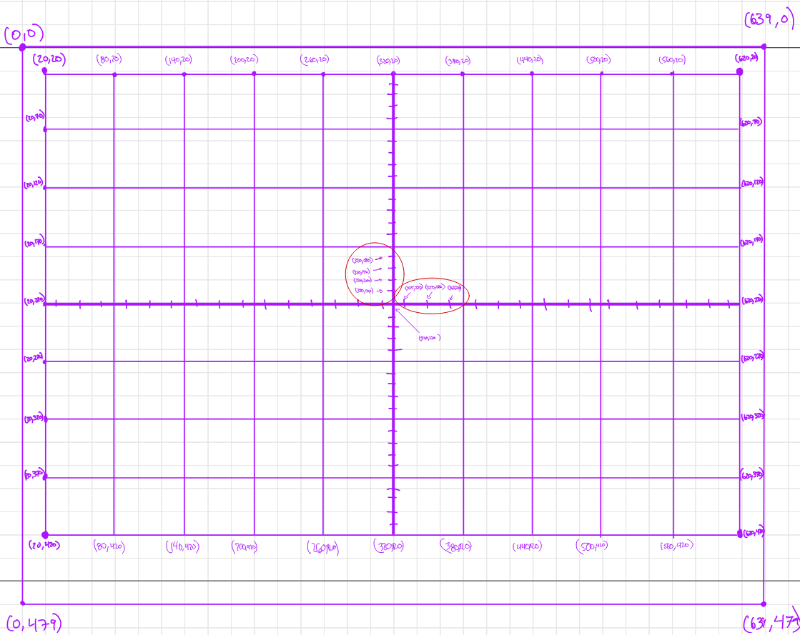
## 1.1 Problem Overview  
VGA is considered a time-critical signal because every pixel is drawn at the exact correct clock cycle to produce the desired image. This introduces the challenge of precise timing between pixels, pulses, and blank intervals. This is accomplished in part with horizontal and vertical synchronization signals. The final product is an oscilloscope display with waveforms, trigger indicators, and a grid.
## 1.2 System Goal  
The overall goals are the design and implement a VGA system in VHDL, generate correct timing for horizontal, vertical, and blanking synchronization, produce a display with 11 vertical lines, 9 horizontal lines, two triangular trigger markers (for time and for voltage), and two waveforms (channel 1 and channel 2). The system will be used in future labs to display real audio signals.
## 1.3 Functional Requirements  
In total, the system must:
1) generate an RGB output (red signal, green signal, and blue signal)
2) generate synchronization signals (horizontal for rows and vertical for frame completion)
3) synchronization signals with active video state, front porch, synch pulse, and back porch
4) zero RGB balues when outside video region
5) use a 25MHz clock
6) horizontal timing based on clock cycle and vertical timing based on row completion
7) a grid with 11 vertical lines and 9 horizontal lines
8) track current row, current position, trigger pixels, channel 1 enable, channel 2 enable
9) contain a reset
## 1.4 High-Level System Description  
The system architecture is deconstructed into smaller components (i.e., a color mapper, a VGA signal generator, a numerical stepper, etc.). The VGA signal generator is responsible for sweeping and generating pixels on the display. The color mapper is used to determine the color of each pixel in a frame. The trigger markers are converted into pixel locations and indicated on the display. The system is tested and verified with multiple testbenches for each component. After testing a bitstream is generated for implementation on an FPGA and VGA is converted to HDMI for use on a monitor.

# 2. Design / Implementation

## 2.1 System Block Diagram 
As can be seen in the attached block diagram, the system broken down into three primary sections: the control logic, the video clock generation, and the VGA signal/Pixel generation. The overall design functions using a scan-based archetecture where the color of the pixel is determined by the coordinate.
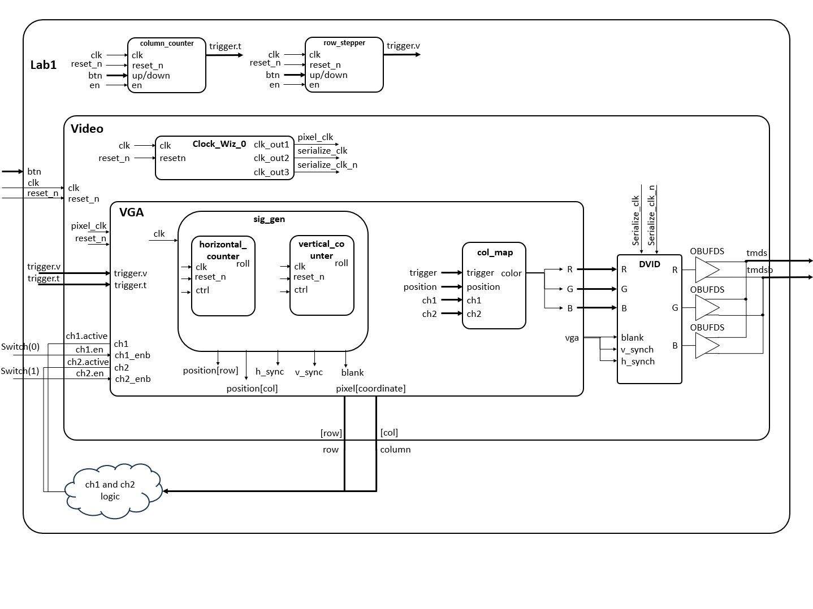
## 2.2 Top-Level Architecture Description
The first step in the architecture is tracking coordinate location. To do this we implemented a horizontal and vertical counter where the horizontal counter rollover feeds into the vertical counter. The color mapper uses these coordinates to determine the RGB value of a pixel. The provided DVID module then converts the RGB into a serialized TMDS signal for communication over HDMI. The position values are additionally used to generate the HSYNC, VSYNC, and blanking regions.

## 2.3 Module Descriptions  

### 2.3.1 Module: Lab1

**Overall Purpose**  
The purpose of this module is to provide the high level control logic. It provides adjustable trigger values and channel enable signals.
**Inputs**
clk, reset_n, btn, sw
**Outputs**
tmds, tmdsb
**Behavior**
The module instantiates the numeric steppers to track and update the postion of the trigger markers. It instantiates the video module which contains the clock wizard, the VGA signal generator, and the color mapper. Using the channel records it determines if the channels are active and enabled based on the switch input and pixel coordinate.

### 2.3.1 Module: Column Counter

**Overall Purpose**  
This component is used to track and update the time trigger marker on the screen. 
**Inputs**
clk, reset_n, btn, en
**Outputs**
trigger.t
**Behavior**
On the rising edge of the clock cycle, the instantiated numeric stepper will update the position of the time trigger by a certain delta between a max and min value indicated in the generic of the component. It accepts the LEFT/RIGHT button inputs to update the trigger coordinate.

### 2.3.2 Module: Vertical Counter  

**Overall Purpose**   
This component is used to track and update the voltage trigger marker on the screen.
**Inputs**
clk, reset_n, btn, en
**Outputs**
trigger.v
**Behavior**
On the rising edge of the clock cycle, the instantiated num00000000pper will update the position of the voltage trigger by a certain delta between a max and min value indicated in the generic of the component. It accepts the UP/DOWN button inputs to update the trigger coordinate.

### 2.3.2 Module: VGA

**Overall Purpose**   
The purpose of the VGA module is to connect the VGA signal generator to the color mapper to determine the RGB value of each pixel and generate the desired frame based on trigger marker position and channel input.
**Inputs**
clk, reset_n, trigger, ch1, ch2
**Outputs**
pixel, vga
**Behavior**
The module instantiates the VGA signal generator component and the color mapper component connecting them with a position signal to update the pixel.color at pixel.coordinate to display the grid, the triggers, and the signals using VGA.

### 2.3.2 Module: sig_gen

**Overall Purpose**   
Sig_gen is an instatiated VGA signal generator component. This purpose of this module is to generate the timing signals and pixel positions for VGA display. It contols the movement of the scanner across the screen using the HSYNC, VSYNC, and Blanking signals from left to right and top to bottom. 
**Inputs**
clk, reset_n
**Outputs**
position.row, position.col, vga.h_sync, vga.v_sync, vga.blank
**Behavior**
Every clock cycle the component increments the column counter. When the column counter reaches its maximum value it resets and increments the row counter which resets after a full frame is generated. Based on column timing and location the HSYNC signal is generated and based on the row the VSYNC signal is generated. When outside of the active video region the blank signal is produced. 

### 2.3.3 Module: horizontal_counter

**Overall Purpose**   
The purpose of this component within the VGA signal generator is to track horizontal pixel position so that horizontal timing regions can be determined. 
**Inputs**
clk, reset_n, ctrl
**Outputs**
roll, Q
**Behavior**
Counts from zero to max column count, resets at the end of each line, generates rollover to increment vertical counter.
### 2.3.3 Module: vertical_counter

**Overall Purpose**   
This counter tracks the row position to determine vertical timing regions.
**Inputs**
clk, reset_n, ctrl
**Outputs**
roll, Q
**Behavior**
Increments once per completed horizontal line, counts through all the rows in the frame, and resets after the final row.

### 2.3.4 Module: Color Mapper  

**Overall Purpose**   
The purpose of the color mapper is to determine the RGB value of each pixel as it is being written to the frame by the signal generator. It creates the oscilloscope grid, trigger markers, and waveform display using the position and signal inputs. 
**Inputs**
trigger, position, ch1, ch2
**Outputs**
color
**Behavior**
It draws the white grid lines at predetermined row/column intervals. It displays the yellow trigger markers at the input trigger positions. It displays channel 1 as yellow when active and within the grid. It displays channel 2 as green when active and within the grid. When nothing special is drawn it displays a black background.
# 3. Test / Debug

## 3.1 Verification Methods  

## 3.2 Testbench Evidence
In total three testbenches were used to verify the functionality of the components and modules. The instructor_tb was used to test the VGA signal generation, the vga_log_tb was used to create a mock frame to test the color mapper, and the NumStepper_tb was used to verify that the numeric stepper components were operating as desired. 
### 3.2.1 HSYNC vs Column Count  
Because our HYSYNC signal is active low, we should see the pulse drop to zero in the sync state. Prior to the sync state (seen in waveform showing HYSYNC starts high) and after the sync state, our waveform will display a '1' while during the sync state it will display a '0.' 
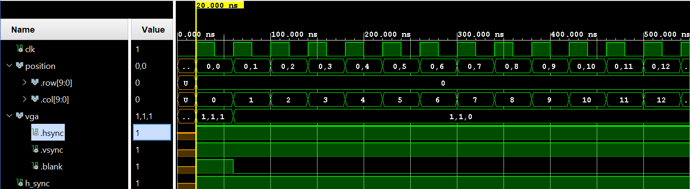
Essentially this signal is used to indicate a jump to the next row after sweeping across all the columns. With an active video range of 640 pixels, front porch of 16 pixels, and sync of 96 pixels, our HYSYNC signal reads low from 655 to 751 as seen in the attached waveform. 

Finally, we see that HSYNC returns to '1' after completing the sync portion of the waveform at 752 pixels for the backporch.

### 3.2.2 VSYNC vs Row and Column Count  
Because our VSYNC signal is active low, we should see the pulse drop to zero in the sync state. Prior to the sync state (seen in waveform showing VSYNC starts high) and after the sync state, our waveform will display a '1' while during the sync state it will display a '0.' 
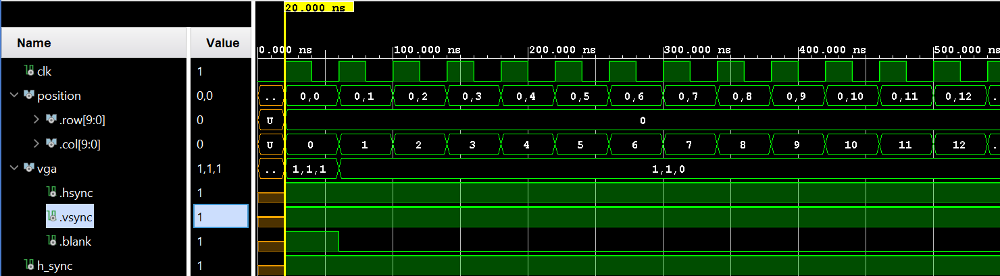
Essentially this signal is used to indicate a jump back to the top left of the screen after completing the whole frame. With an active video range of 480 lines, front porch of 10 lines, and sync of 2 lines, our VSYNC signal reads low from lines 489 to 492 as seen in the attached waveform. 
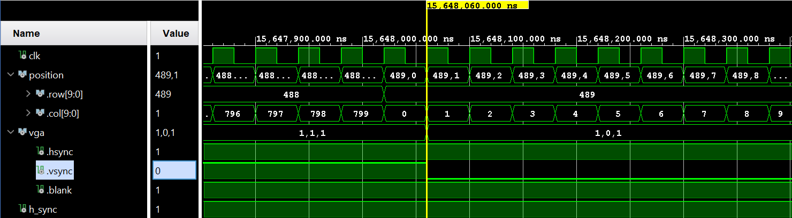
Finally, we see that VSYNC returns to '1' after completing the sync portion of the waveform at 492 lines for the backporch.
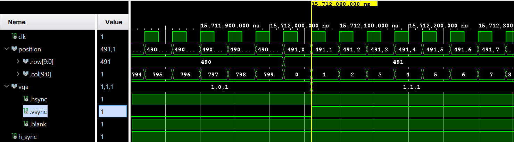
### 3.2.3 Blanking Signals  
Our blanking signal is also an active high, which means that we need to set it low, '0', during the active video range to prevent a blank screen. This means that we need to set it low from column column pixel count 0 to 639 and row count 0 to 479. Additionally, since we will be wrapping around from rows and columns we need to reset the blank signal at the end of each row at column 799 and row 524 to '0.' Attached below are four images displaying the changing blanking signals at the discussed locations.
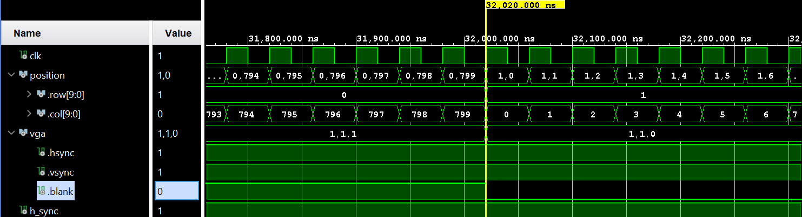
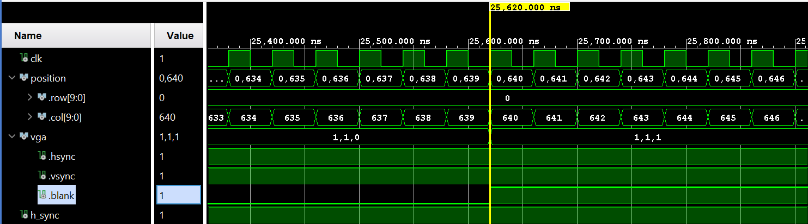
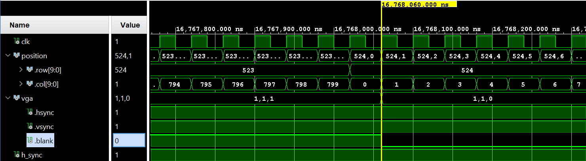
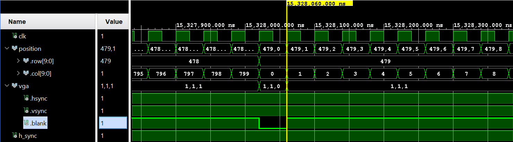
### 3.2.4 Counter Rollover Behavior  
Important to the functioning of Lab 1 are functioning counters. For the VGA synchronization and pixel tracking to behave, the column rounter needs to roll over, triggering the row counter to iterate and count by 1. Both must also exhibit reset functionality at their max values. For the col_counter, the max value is 799, while for the row_counter the max value is 524 lines. This is to accomodate the front porch, sync, and backporch in addition to the active video range. As seen in the figure below, upon the col_counter reaching 799, it triggers a roll signal which is tied to the control input of the row_counter. This causes the row_counter to iterate by 1 while the col_counter resets. Additionally displayed are the max values of both counters. 
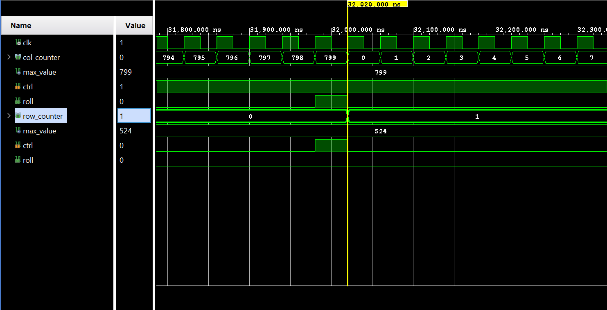
## 3.3 Problems Encountered and Solutions  
Throughout the creation of the lab there were a variety of different problems that were solved.
### 3.3.1 Problem 1 
The first problem was not with the programming, but instead with the file properties. In order to accomodate records, which are essentially structs, all of the file types needed to be set to VHDL 2008 rather than VHDL. This caused undetected issues that were difficult to find.
### 3.3.2 Problem 2  
The second problem was growing used to VHDL syntax. As it has been two years since my most recent VHDL lab, there are still growing pains with learning the language. THis is easily solved with the internal error finder. 
### 3.3.3 Problem 3  
The third and most significant problem was a logic error within the VGA signal generator component. This error was not detected during the bit stream generation, but would cause a black screen to display when tested. The source of the error was using large embedded "if-then" statements rather than using boolean logic to change the HSYNC, VSYNC, and Blank signals. After fixing this error the program functioned properly besides minor tweaks here and there to the constraints file to activate sw[0] and sw[1], align the buttons, and ensure my color mapper was checking for ch1.en and ch2.en.

# 4. Results
Gate check one functionality achieved on 26 Jan at 10:17am. THis funcitonality included the properly functioning counters with roll-over logic. Gate check two functionality achieved on 28 Jan at 11:03am. This functionality included properly generated vsync, hsync, and blank signals on a waveform. Additionally, I was able to use the vga_log.tb to create and test a functioning color mapper on this date. The rest of the functionality including showing wiring the switches to the channels and testing the buttons for trigger control was achieved at 2300 at 31 Jan. While this functionality was previously programmed, I was unable to test and confirm until 31 Jan due to the logic issues within the VGA signal generation component. Upon fixing that error, all other functionality was quickly testing and realized. A final working demo of my lab1 functionality is uploaded to the folder in Teams as a video. 

# 5. Conclusion

## 5.1 Lessons Learned  
Within this lab, I learned how VGA display's work - including hsync, vsync, and blank in addition to the front porch, backporch, and sync stages. Additionally, I have become a lot more comfortable working within vivado and writing in VHDL - including creating and wiring components as well as testing their functionality.
## 5.2 Recommended Improvements  
I would recommend a more fullproof instructor_tb so that any signal generation errors are caught earlier on in development.